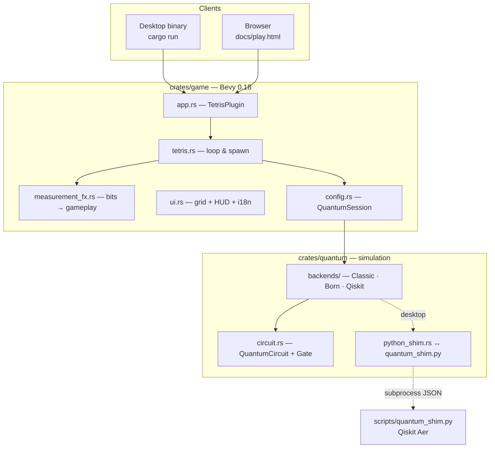
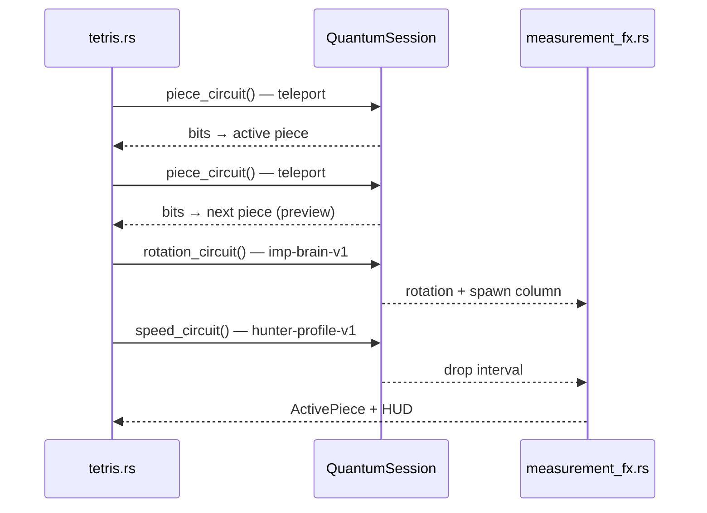
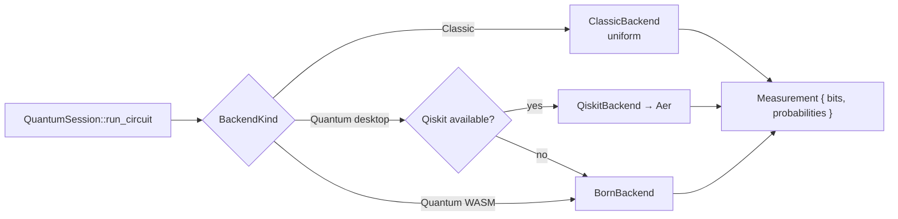

# Quantum Tetris

**[Version française → README.md](README.md)**

Neon Tetris where **every stochastic outcome in the game** comes from a quantum circuit. Only keyboard moves (← → ↑ ↓) are classical; the active piece, next-piece preview, rotation, spawn column, drop speed, observation bonus, and line-clear multiplier are all **Born-rule measurements** (Qiskit Aer on desktop, Qiskit-matched statevector simulator in the browser).

**Play online:** [thepriben.github.io/quantum-tetris/play.html](https://thepriben.github.io/quantum-tetris/play.html)

---

## Architecture — big picture

The repo cleanly separates the **game engine** (Bevy), the **quantum layer** (circuit IR + backends), and **tooling** (Qiskit Python, WASM build, GitHub Pages).



**Core idea:** the game only calls `QuantumBackend::run(circuit) → Measurement`, then decodes bitstrings in `measurement_fx.rs`. Switching backends (classic, Born, Qiskit) never changes Tetris logic.

---

## Quantum pipeline on every spawn

Four measurements run before the piece appears:



| Moment | Qiskit circuit | Gameplay effect |
| --- | --- | --- |
| Spawn | `quantum-teleportation-gate-v1` ×2 | Active piece + **next** preview (Bell family, message qubit) |
| Spawn | `imp-brain-v1` | Rotation 0–3, spawn column X |
| Spawn | `enemy-profile-hunter-v1` | Drop speed |
| Space | `observation-pulse-v1` | Score bonus / line echo |
| Line clear | `q-shard-stabilizer-v1` | Score multiplier ×1–×4 |

PNG diagrams → [docs/circuits/](docs/circuits/) · details → [docs/QUANTUM.md](docs/QUANTUM.md)

---

## Backends: one API, three implementations

| Backend | Where | Mechanism | Purpose |
| --- | --- | --- | --- |
| **Classic** | everywhere | uniform `rand` | Arcade baseline, in-game CLASSIC mode |
| **Born** | WASM + desktop fallback | Rust statevector, Born rule | Same gates as Qiskit, no Python |
| **Qiskit Aer** | desktop (+ CI) | subprocess → `quantum_shim.py` | Reference “real” simulation |



- Environment: `QUANTUM_MODE=classic|qiskit` (alias `QUANTUM_BACKEND`)
- Runtime toggle: in-game **CLASSIC** / **QUANTUM** buttons
- Born ↔ Qiskit parity checked in CI (`born_qiskit_parity`)

---

## Crate `quantum-tetris-quantum` (`crates/quantum/`)

Portable layer, no Bevy dependency.

| Module | Role |
| --- | --- |
| `circuit.rs` | IR `Gate` (H, X, Z, CNOT, Ry) + gameplay presets |
| `measurement.rs` | `Measurement { bits, probabilities }` |
| `backends/classic.rs` | Uniform sampling |
| `backends/born.rs` | Statevector simulator (WASM-safe) |
| `backends/qiskit.rs` | Python delegation |
| `python_shim.rs` | Spawn `quantum_shim.py`, JSON stdin/stdout |
| `error.rs` | Backend errors |

**Feature flags:** `backend-qiskit` (enabled by desktop binary via `qiskit`).

---

## Crate `quantum-tetris` (`crates/game/`)

Bevy 2D game — neon UI grid, no 3D assets.

| Module | Role |
| --- | --- |
| `app.rs` | `TetrisPlugin`, window, system chain |
| `tetris.rs` | Gravity, input, quantum spawn, game over |
| `board.rs` | 10×20 grid, collisions, line clears |
| `pieces.rs` | Shapes, colors, families (Line, Block, Fork, Corner) |
| `measurement_fx.rs` | Decode Bell → tetromino, observe, stabilizer |
| `ui.rs` | Grid, panel, circuit explanation, `(en)` toggle |
| `i18n.rs` | French default, English in-game |
| `config.rs` | `QuantumSession`, fallback, backend hot-swap |
| `game_state.rs` | Score, lines, confidence %, last event |
| `main.rs` | Desktop entry + `.env` |
| `lib.rs` | `run_wasm()` for browser bundle |

**Update loop (chained):** `handle_lang_button` → `handle_mode_buttons` → `tick_gravity` → `handle_input` → `refresh_ui`

---

## Scripts & documentation

```
quantum-tetris/
├── crates/
│   ├── game/              # Bevy — binary + WASM cdylib
│   └── quantum/           # Circuit IR + backends + tests
├── docs/
│   ├── index.html         # Landing FR/EN (i18n.js)
│   ├── play.html          # WASM loader
│   ├── circuits/*.png     # Generated Qiskit diagrams
│   ├── QUANTUM.md         # Circuit & bit-mapping reference
│   ├── WASM.md            # Browser build & deploy
│   └── DESIGN.md          # Internal design notes
├── scripts/
│   ├── build_wasm.sh      # cargo wasm32 + wasm-bindgen → docs/wasm/
│   ├── quantum_shim.py    # JSON bridge ↔ Qiskit Aer
│   └── render_circuit_diagrams.py
└── .github/workflows/
    ├── ci.yml             # fmt, clippy, tests, wasm check, Qiskit
    └── pages.yml          # WASM build + diagrams → GitHub Pages
```

---

## CI / deployment

| Workflow | Trigger | Actions |
| --- | --- | --- |
| **CI** | push / PR `main` | `rust`: fmt, clippy, tests, WASM check · `quantum-qiskit`: Python tests + Born parity |
| **Pages** | push `main` | Release WASM build, Qiskit diagrams, deploy `docs/` |

Pages requires a **public** repository (GitHub free plan).

---

## Run locally

```bash
cp .env.example .env          # QUANTUM_MODE=classic by default
cargo run -p quantum-tetris
```

| Mode | Command |
| --- | --- |
| Classic | `QUANTUM_MODE=classic cargo run -p quantum-tetris` |
| Qiskit Aer | `pip install -r scripts/requirements.txt` then `QUANTUM_MODE=qiskit cargo run -p quantum-tetris` |

**Browser:**

```bash
./scripts/build_wasm.sh
python3 -m http.server 8080 --directory docs
# → http://localhost:8080/play.html
```

---

## Controls

| Key | Action | Quantum? |
| --- | --- | --- |
| ← → | Move | No (player) |
| ↑ | Manual rotate | No (player) |
| ↓ | Soft drop | No (player) |
| **Space** | Hard drop + **Observe!** | **Yes** — `observation-pulse-v1` |

---

## License

MIT — [LICENSE](LICENSE)
