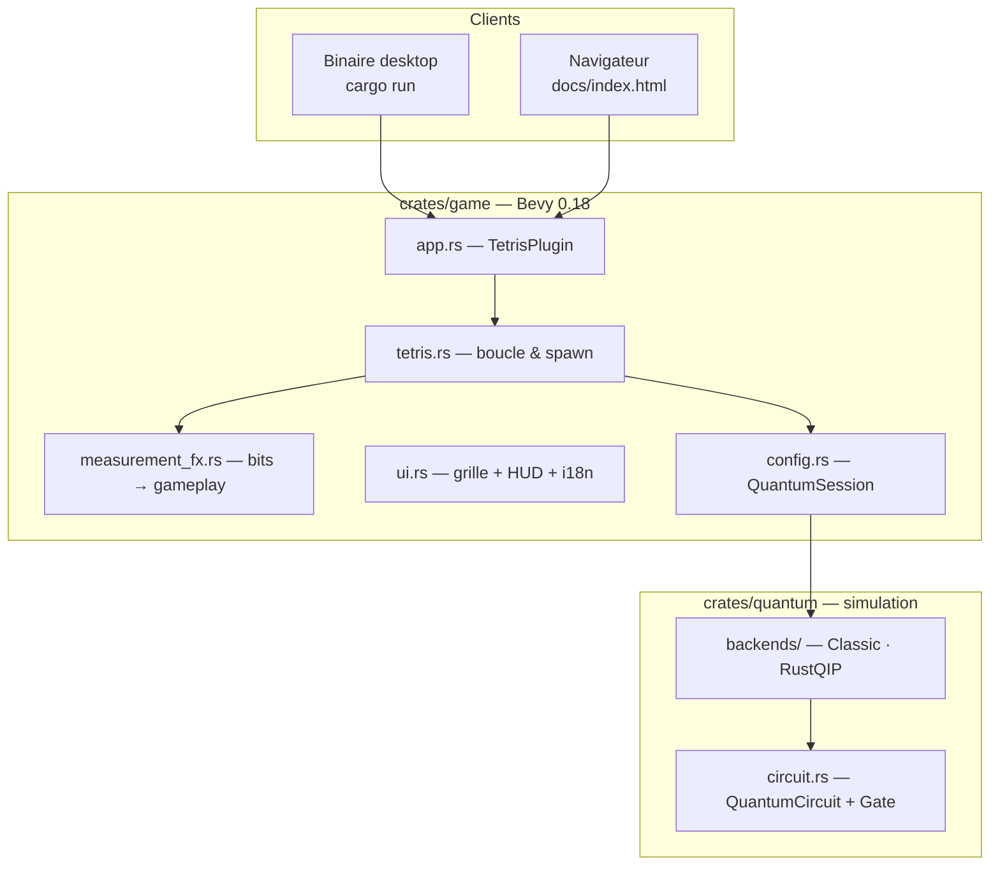
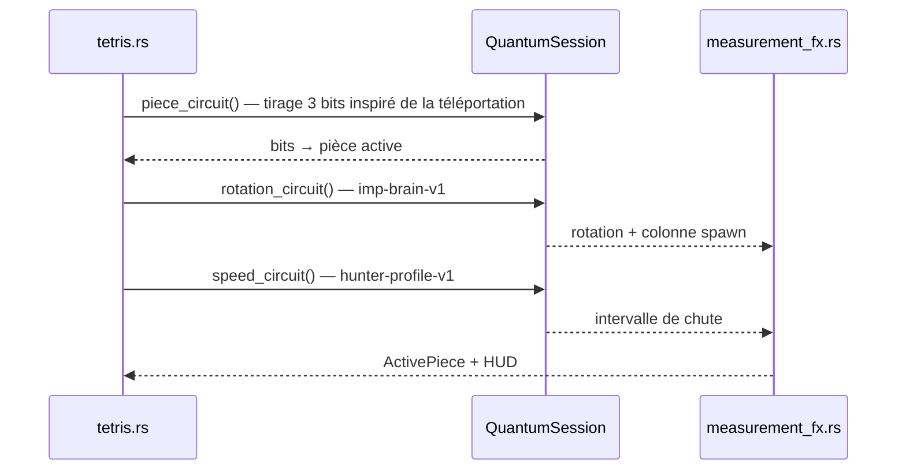

# Quantum Tetris

<p align="center">
  <strong>🇬🇧 <a href="README.md">English</a></strong> · <strong>🇫🇷 Français</strong>
</p>

<p align="center">
  <a href="https://thepriben.github.io/quantum-tetris/"><strong>▶ Jouer en ligne</strong></a>
</p>


Tetris où les événements stochastiques (pièce, état d’apparition, cadence, bonus…) sont pilotés par des circuits quantiques mesurés en mode par défaut. Le joueur garde les commandes ← → ↑ ↓ et Espace ; le jeu tire le reste depuis les mesures.

> **Le joueur :** ← → ↑ ↓ et Espace · **Le jeu :** tout le reste.

**Exécution.** Bevy (Rust), en binaire desktop ou WASM dans le navigateur. Mode quantum par défaut : simulation statevector [**RustQIP**](https://github.com/Renmusxd/RustQIP), avec les mêmes circuits en local et en ligne.

---

## Gameplay & circuits

À chaque moment stochastique, le moteur invoque un circuit de la liste partagée (voir [`docs/QUANTUM.md`](docs/QUANTUM.md)). Les diagrammes sont générés depuis les mêmes définitions de portes, recopiées dans [`scripts/render_circuit_diagrams.py`](scripts/render_circuit_diagrams.py).

### Tirage de la pièce

| | |
|---|---|
| **En jeu** | Détermine le tétromino en chute. |
| **Circuit** | `quantum-teleportation-gate-v1` — une mesure de Bell inspirée de la téléportation ; le résultat 3 bits choisit directement le tétromino actif. |

<p align="left"></p>

### Rotation & colonne

| | |
|---|---|
| **En jeu** | Fixe l’orientation à l’apparition et la colonne d’entrée. |
| **Circuit** | `imp-brain-v1` — 2 qubits mesurés → rotation (0–3) et colonne d'apparition. |

<p align="left"></p>

### Cadence de chute

| | |
|---|---|
| **En jeu** | Intervalle entre deux descentes ; diminue avec le niveau. |
| **Circuit** | `enemy-profile-hunter-v1` — 2 qubits mesurés → intervalle de chute pour la pièce en cours. |

<p align="left"></p>

### Espace — chute forcée

| | |
|---|---|
| **En jeu** | Pose immédiate ; bonus de score, parfois une ligne supplémentaire. |
| **Circuit** | `observation-pulse-v1` — mesure à la pose forcée ; les bits choisissent le bonus. |

<p align="left"></p>

### Ligne complétée

| | |
|---|---|
| **En jeu** | Multiplicateur de points ×1 à ×4 selon le tirage. |
| **Circuit** | `q-shard-stabilizer-v1` — après effacement d'une ligne ; les bits fixent le multiplicateur (×1–×4). |

<p align="left"></p>

---

## Démarrage rapide

**Desktop**

```bash
cp .env.example .env          # optionnel ; QUANTUM_MODE=quantum est le défaut
cargo run -p quantum-tetris
```

| Mode | Commande |
| --- | --- |
| Quantum — RustQIP (défaut) | `cargo run -p quantum-tetris` |
| Classique | `QUANTUM_MODE=classic cargo run -p quantum-tetris` |

**Navigateur** (nécessite ~3 Go d’espace libre pour le build WASM release)

```bash
cargo install wasm-bindgen-cli   # une fois
./scripts/build_wasm.sh
python3 -m http.server 8080 --directory docs
# → http://localhost:8080/
```

**Contrôles :** ← → déplacer · ↑ rotation · ↓ chute douce · **Espace** chute forcée + observe (`observation-pulse-v1`).

---

## Architecture

Le dépôt sépare le **moteur de jeu** (Bevy), la **couche quantique** (IR + backends) et **l’outillage** (rendu des diagrammes, build WASM, Pages).



**Principe :** le jeu n’appelle que `QuantumBackend::run(circuit) → Measurement`, puis décode les bitstrings via `measurement_fx.rs`. Passer de Classic à RustQIP ne modifie jamais la logique Tetris.

### Pipeline au spawn

Trois mesures s’enchaînent avant chaque pièce :



### Backends

| Backend | Où | Mécanisme |
| --- | --- | --- |
| **Classic** | partout | `rand` uniforme — baseline sans simulateur |
| **RustQIP** | desktop + navigateur | simulateur statevector in-process |

- `QUANTUM_MODE=classic|quantum` (alias `QUANTUM_BACKEND`)
- Bascule **CLASSIQUE** / **RUSTQIP** in-game

---

## Arborescence

```
quantum-tetris/
├── crates/
│   ├── game/              # Bevy — binaire + cdylib WASM
│   └── quantum/           # IR circuits + backends + tests
├── docs/
│   ├── index.html         # Jeu + guide (anglais par défaut)
│   ├── circuits/*.png     # Diagrammes de circuits
│   ├── QUANTUM.md         # Référence circuits & bits
│   └── WASM.md            # Notes build navigateur
├── scripts/
│   ├── build_wasm.sh
│   ├── clean_build.sh
│   └── render_circuit_diagrams.py
└── .github/workflows/
    ├── ci.yml
    └── pages.yml          # WASM + diagrammes → GitHub Pages
```

---

## CI / déploiement

| Workflow | Déclencheur | Actions |
| --- | --- | --- |
| **CI** | push / PR `main` | fmt, clippy, tests, check WASM |
| **Pages** | push `main` | Build WASM release, PNG circuits, deploy `docs/` |

En ligne : [thepriben.github.io/quantum-tetris/](https://thepriben.github.io/quantum-tetris/)

---

## Publication

Ce projet est le code compagnon d'un article paru dans **_Programmez!_** :

> Benoît Prieur — *« Quantum Tetris : Rust, Bevy, WebAssembly et circuits quantiques dans la boucle de jeu »*, **_Programmez!_** hors-série n°23, 2026, pp. 7–11 ([lien](https://www.programmez.com/magazine/article/quantum-tetris-rust-bevy-webassembly-et-circuits-quantiques-dans-la-boucle-de-jeu)).

## Projets liés

- [**RustQIP**](https://github.com/Renmusxd/RustQIP) — le simulateur statevector `qip` qui alimente le backend quantique par défaut (`RustQipBackend`). Quantum Tetris en est une vitrine ludique, exécutée nativement comme dans le navigateur via WASM.

---

## Licence

MIT — [LICENSE](LICENSE)
