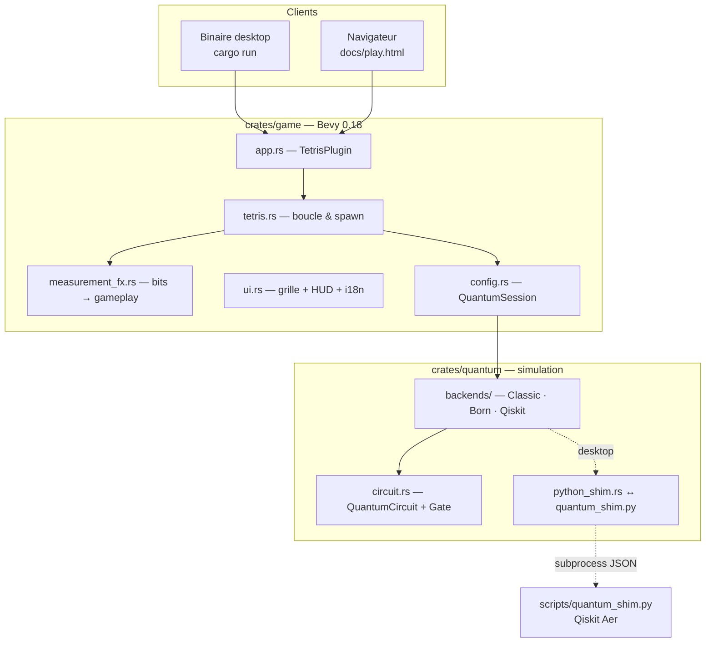
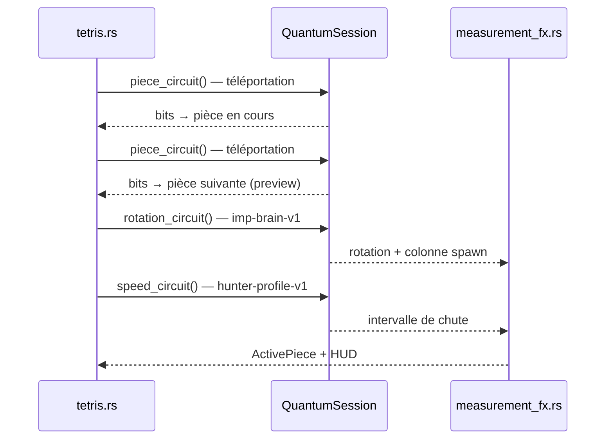
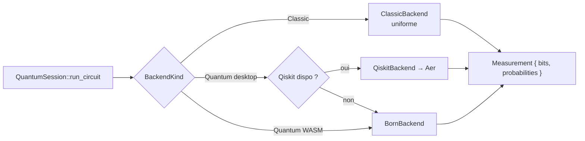

# Quantum Tetris

**[English version → README.en.md](README.en.md)**

Tetris néon où **toute la stochasticité du jeu** est produite par des circuits quantiques. Seuls les déplacements clavier (← → ↑ ↓) restent classiques ; pièce actuelle, pièce suivante, rotation, colonne, vitesse, bonus d'observation et multiplicateur de lignes passent par une **mesure Born** (Qiskit Aer sur desktop, simulateur statevector calibré dans le navigateur).

**Jouer en ligne :** [thepriben.github.io/quantum-tetris/play.html](https://thepriben.github.io/quantum-tetris/play.html)

---

## Architecture — vue d'ensemble

Le dépôt sépare strictement **le moteur de jeu** (Bevy), **la couche quantique** (IR de circuits + backends) et **l'outillage** (Python Qiskit, build WASM, Pages).



**Principe directeur :** le jeu ne connaît que `QuantumBackend::run(circuit) → Measurement`. Il interprète ensuite les bitstrings via `measurement_fx.rs`. Changer de backend (classique, Born, Qiskit) ne modifie pas la logique Tetris.

---

## Pipeline quantique à chaque spawn

Quatre mesures s'enchaînent avant que la pièce n'apparaisse :



| Moment | Circuit Qiskit | Paramètres gameplay |
| --- | --- | --- |
| Spawn | `quantum-teleportation-gate-v1` ×2 | Pièce active + **next** (famille Bell, qubit message) |
| Spawn | `imp-brain-v1` | Rotation 0–3, colonne X |
| Spawn | `enemy-profile-hunter-v1` | Vitesse de chute |
| Espace | `observation-pulse-v1` | Bonus score / ligne echo |
| Ligne effacée | `q-shard-stabilizer-v1` | Multiplicateur ×1–×4 |

Diagrammes PNG → [docs/circuits/](docs/circuits/) · détails → [docs/QUANTUM.md](docs/QUANTUM.md)

---

## Backends : une API, trois implémentations

| Backend | Où | Mécanisme | Rôle |
| --- | --- | --- | --- |
| **Classic** | partout | `rand` uniforme | Baseline arcade, mode CLASSIQUE in-game |
| **Born** | WASM + fallback desktop | Statevector Rust, règle de Born | Même portes que Qiskit, sans Python |
| **Qiskit Aer** | desktop (+ CI) | Subprocess → `quantum_shim.py` | Référence « vraie » simulation |



- Variable d'environnement : `QUANTUM_MODE=classic|qiskit` (alias `QUANTUM_BACKEND`)
- Bascule runtime : boutons **CLASSIQUE** / **QUANTIQUE** (HUD)
- Parité Born ↔ Qiskit vérifiée en CI (`born_qiskit_parity`)

---

## Crate `quantum-tetris-quantum` (`crates/quantum/`)

Couche portable, sans dépendance Bevy.

| Module | Rôle |
| --- | --- |
| `circuit.rs` | IR `Gate` (H, X, Z, CNOT, Ry) + presets gameplay |
| `measurement.rs` | `Measurement { bits, probabilities }` |
| `backends/classic.rs` | Tirage uniforme |
| `backends/born.rs` | Simulateur statevector (WASM-safe) |
| `backends/qiskit.rs` | Délégation Python |
| `python_shim.rs` | Spawn `quantum_shim.py`, JSON stdin/stdout |
| `error.rs` | Erreurs backend |

**Feature flags :** `backend-qiskit` (activée par le binaire desktop via `qiskit`).

---

## Crate `quantum-tetris` (`crates/game/`)

Jeu Bevy 2D — grille UI néon, pas de assets 3D.

| Module | Rôle |
| --- | --- |
| `app.rs` | `TetrisPlugin`, fenêtre, chaîne de systems |
| `tetris.rs` | Gravité, input, spawn quantique, game over |
| `board.rs` | Grille 10×20, collisions, effacement lignes |
| `pieces.rs` | Formes, couleurs, familles (Line, Block, Fork, Corner) |
| `measurement_fx.rs` | Décode Bell → tetromino, observe, stabilizer |
| `ui.rs` | Grille, panneau, explication circuit, bouton `(en)` |
| `i18n.rs` | FR par défaut, EN in-game |
| `config.rs` | `QuantumSession`, fallback, hot-swap backend |
| `game_state.rs` | Score, lignes, confiance %, dernier événement |
| `main.rs` | Point d'entrée desktop + `.env` |
| `lib.rs` | `run_wasm()` pour le bundle navigateur |

**Boucle Update (chaînée) :** `handle_lang_button` → `handle_mode_buttons` → `tick_gravity` → `handle_input` → `refresh_ui`

---

## Scripts & documentation

```
quantum-tetris/
├── crates/
│   ├── game/              # Bevy — binaire + cdylib WASM
│   └── quantum/           # IR circuits + backends + tests
├── docs/
│   ├── index.html         # Landing FR/EN (i18n.js)
│   ├── play.html          # Loader WASM
│   ├── circuits/*.png     # Diagrammes Qiskit générés
│   ├── QUANTUM.md         # Référence circuits & bit mappings
│   ├── WASM.md            # Build & déploiement navigateur
│   └── DESIGN.md          # Notes design internes
├── scripts/
│   ├── build_wasm.sh      # cargo wasm32 + wasm-bindgen → docs/wasm/
│   ├── quantum_shim.py    # Pont JSON ↔ Qiskit Aer
│   └── render_circuit_diagrams.py
└── .github/workflows/
    ├── ci.yml             # fmt, clippy, tests, wasm check, Qiskit
    └── pages.yml          # Build WASM + diagrammes → GitHub Pages
```

---

## CI / déploiement

| Workflow | Déclencheur | Actions |
| --- | --- | --- |
| **CI** | push / PR `main` | `rust` : fmt, clippy, tests, check WASM · `quantum-qiskit` : tests Python + parité Born |
| **Pages** | push `main` | Build WASM release, diagrammes Qiskit, deploy `docs/` |

Pages nécessite un dépôt **public** (plan gratuit GitHub).

---

## Lancer en local

```bash
cp .env.example .env          # QUANTUM_MODE=classic par défaut
cargo run -p quantum-tetris
```

| Mode | Commande |
| --- | --- |
| Classique | `QUANTUM_MODE=classic cargo run -p quantum-tetris` |
| Qiskit Aer | `pip install -r scripts/requirements.txt` puis `QUANTUM_MODE=qiskit cargo run -p quantum-tetris` |

**Navigateur :**

```bash
./scripts/build_wasm.sh
python3 -m http.server 8080 --directory docs
# → http://localhost:8080/play.html
```

---

## Contrôles

| Touche | Action | Quantique ? |
| --- | --- | --- |
| ← → | Déplacer | Non (joueur) |
| ↑ | Rotation manuelle | Non (joueur) |
| ↓ | Chute accélérée | Non (joueur) |
| **Espace** | Chute forcée + **Observe!** | **Oui** — `observation-pulse-v1` |

---

## Licence

MIT — [LICENSE](LICENSE)
