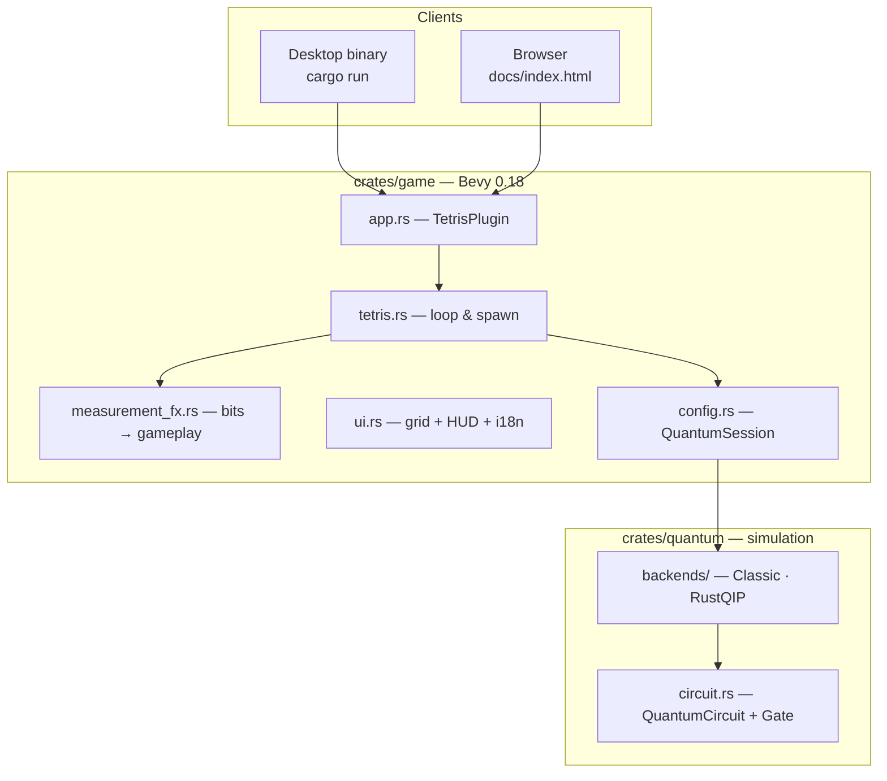
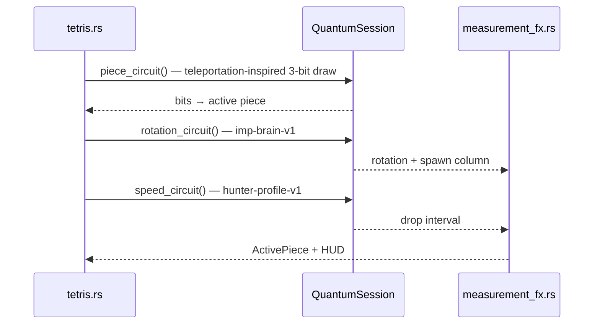

# Quantum Tetris

<p align="center">
  <strong>🇬🇧 English</strong> · <strong>🇫🇷 <a href="README.fr.md">Français</a></strong>
</p>

<p align="center">
  <a href="https://thepriben.github.io/quantum-tetris/"><strong>▶ Play online</strong></a>
</p>


Tetris where stochastic game events (piece, spawn state, cadence, bonuses…) are driven by measured quantum circuits in the default mode. The player still controls movement with ← → ↑ ↓ and Space; the game draws everything else from circuit measurements.

> **The player:** ← → ↑ ↓ and Space · **The game:** everything else.

**Runtime.** Bevy (Rust), shipped as a desktop binary or WASM in the browser. Quantum mode defaults to [**RustQIP**](https://github.com/Renmusxd/RustQIP) statevector simulation, so the same circuit presets run locally and online.

---

## Publications & releases

Each tagged release pins a reproducible code snapshot.

| Publication | Release |
| --- | --- |
| **Article *Programmez!*** — Benoît Prieur, *« Quantum Tetris : Rust, Bevy, WebAssembly et circuits quantiques dans la boucle de jeu »*, hors-série n°23, 2026, pp. 7–11. [Link](https://www.programmez.com/magazine/article/quantum-tetris-rust-bevy-webassembly-et-circuits-quantiques-dans-la-boucle-de-jeu) | [`programmez-hs23`](https://github.com/thepriben/quantum-tetris/releases/tag/programmez-hs23) |
| **Auditable randomness (C5/C6)** — hash-chained draw receipts, commit-reveal session journal, export on game over. See [`docs/AUDIT.md`](docs/AUDIT.md). | [`preprint-randomness`](https://github.com/thepriben/quantum-tetris/releases/tag/preprint-randomness) |

**Reproducing a release**

```bash
git checkout programmez-hs23    # code behind the *Programmez!* article
git checkout preprint-randomness  # audit journal + C5/C6 verification stack
```

---

## Auditable randomness

Every stochastic draw in the default game mode is logged in a **hash-chained audit journal** (layers C5 and C6). On desktop game over, the session is revealed and exported to `audit/{session_id}.json`.

| Step | Command / action |
| --- | --- |
| Play (desktop) | `cargo run -p quantum-tetris-game` — journal finalizes on game over |
| Verify export | `./scripts/verify_audit.sh audit/qt-….json` |
| Read the stack | [`docs/AUDIT.md`](docs/AUDIT.md) — six-layer context, JSON schema, hash chain, tests |
| Mapping bias (C4) | Piece **T** at P=¼ under uniform 3-bit draws (`010` and `111`) — [`docs/QUANTUM.md`](docs/QUANTUM.md) |

---

## Gameplay & circuits

Each stochastic moment invokes a circuit from the shared preset list (see [`docs/QUANTUM.md`](docs/QUANTUM.md)). The diagrams below are generated from the same gate definitions mirrored by [`scripts/render_circuit_diagrams.py`](scripts/render_circuit_diagrams.py).

### Active Piece Draw

| | |
|---|---|
| **In-game** | Sets the falling tetromino. |
| **Circuit** | `quantum-teleportation-gate-v1` — one teleportation-inspired Bell measurement; the 3-bit readout maps directly to the active tetromino. |

<p align="left"></p>

### Rotation & column

| | |
|---|---|
| **In-game** | Sets spawn orientation and entry column. |
| **Circuit** | `imp-brain-v1` — 2 measured qubits → rotation (0–3) and spawn column. |

<p align="left"></p>

### Drop cadence

| | |
|---|---|
| **In-game** | Interval between grid steps; decreases as level rises. |
| **Circuit** | `enemy-profile-hunter-v1` — 2 measured qubits → drop interval for the active piece. |

<p align="left"></p>

### Space — hard drop

| | |
|---|---|
| **In-game** | Instant lock; score bonus, sometimes one extra line. |
| **Circuit** | `observation-pulse-v1` — measure on hard drop; bits select the score bonus. |

<p align="left"></p>

### Line clear

| | |
|---|---|
| **In-game** | Score multiplier ×1 to ×4 from the draw. |
| **Circuit** | `q-shard-stabilizer-v1` — after a line clear; bits set the multiplier (×1–×4). |

<p align="left"></p>

---

## Quick start

**Desktop**

```bash
cp .env.example .env          # optional; QUANTUM_MODE=quantum is the default
cargo run -p quantum-tetris
```

| Mode | Command |
| --- | --- |
| Quantum — RustQIP (default) | `cargo run -p quantum-tetris` |
| Classic | `QUANTUM_MODE=classic cargo run -p quantum-tetris` |

**Browser** (needs ~3 GiB free disk for the release WASM build)

```bash
cargo install wasm-bindgen-cli   # once
./scripts/build_wasm.sh
python3 -m http.server 8080 --directory docs
# → http://localhost:8080/
```

**Controls:** ← → move · ↑ rotate · ↓ soft drop · **Space** hard drop + quantum observe (`observation-pulse-v1`).

---

## Architecture

The repo separates the **game engine** (Bevy), the **quantum layer** (circuit IR + backends), and **tooling** (diagram rendering, WASM build, GitHub Pages).



**Core idea:** the game only calls `QuantumBackend::run(circuit) → Measurement`, then decodes bitstrings in `measurement_fx.rs`. Switching between Classic and RustQIP never changes the Tetris logic.

### Spawn pipeline

Three measurements run before each piece appears:



### Backends

| Backend | Where | Mechanism |
| --- | --- | --- |
| **Classic** | everywhere | uniform `rand` — baseline without a simulator |
| **RustQIP** | desktop + browser | in-process statevector simulator |

- `QUANTUM_MODE=classic|quantum` (alias `QUANTUM_BACKEND`)
- In-game **CLASSIC** / **RUSTQIP** buttons

---

## Repository layout

```
quantum-tetris/
├── crates/
│   ├── game/              # Bevy — binary + WASM cdylib
│   └── quantum/           # Circuit IR + backends + tests
├── docs/
│   ├── index.html         # Game + mechanics guide (English default)
│   ├── circuits/*.png     # circuit diagrams
│   ├── QUANTUM.md         # Circuit & bit-mapping reference
│   ├── AUDIT.md           # C5/C6 audit journal & verification
│   └── WASM.md            # Browser build notes
├── scripts/
│   ├── build_wasm.sh
│   ├── clean_build.sh
│   └── render_circuit_diagrams.py
└── .github/workflows/
    ├── ci.yml
    └── pages.yml          # WASM + diagrams → GitHub Pages
```

---

## CI / deployment

| Workflow | Trigger | Actions |
| --- | --- | --- |
| **CI** | push / PR `main` | fmt, clippy, tests, WASM check |
| **Pages** | push `main` | Release WASM build, circuit PNGs, deploy `docs/` |

Live: [thepriben.github.io/quantum-tetris/](https://thepriben.github.io/quantum-tetris/)

---

## Related projects

- [**RustQIP**](https://github.com/Renmusxd/RustQIP) — the `qip` statevector simulator that powers the default quantum backend (`RustQipBackend`). Quantum Tetris is a downstream, game-oriented showcase of RustQIP running both natively and in the browser via WASM.

---

## License

MIT — [LICENSE](LICENSE)
