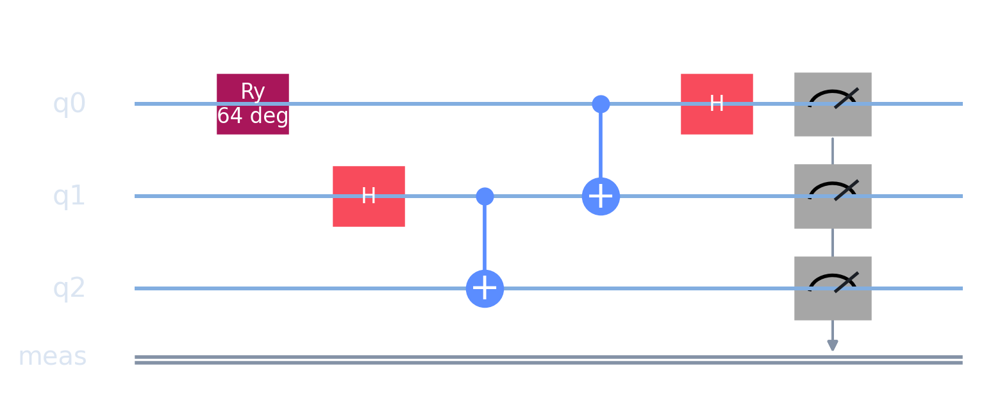
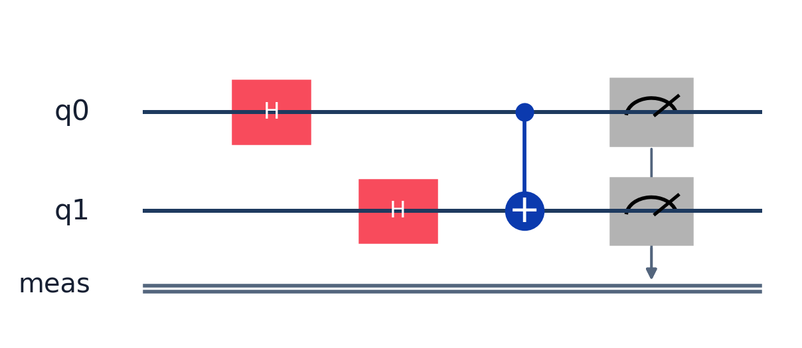
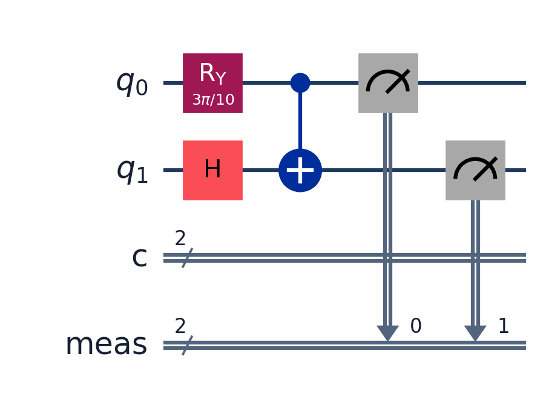
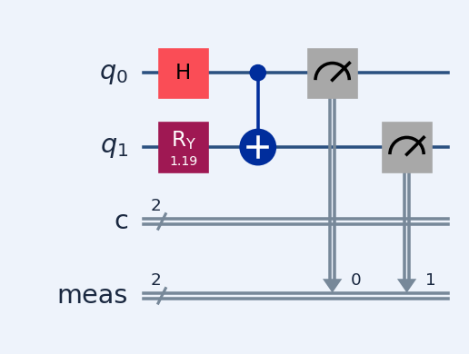
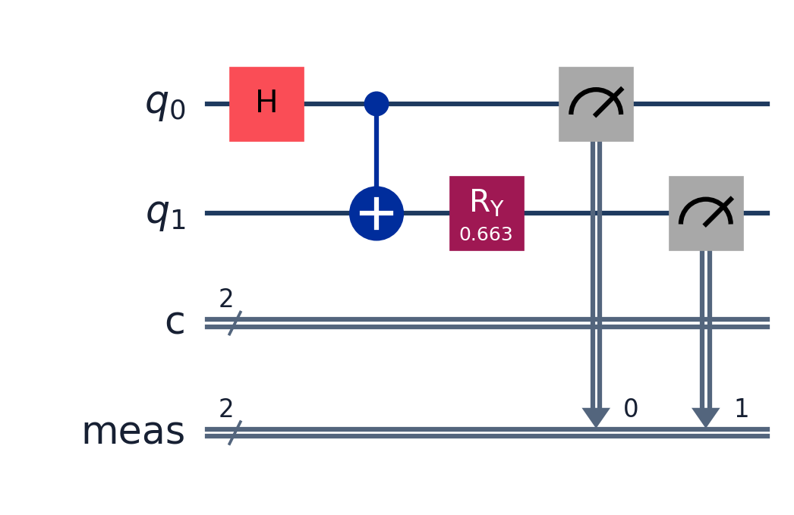
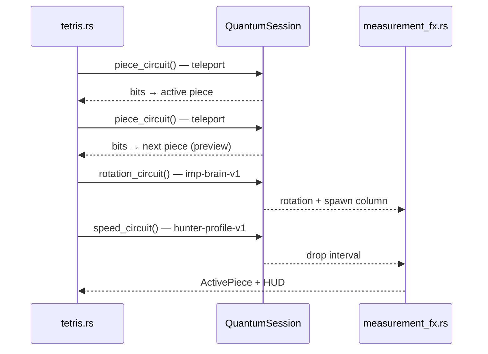

# Quantum Tetris

<p align="center">
  <strong>🇬🇧 English</strong> · <strong>🇫🇷 <a href="README.fr.md">Français</a></strong>
</p>

<p align="center">
  <a href="https://thepriben.github.io/quantum-tetris/"><strong>▶ Play online</strong></a>
</p>

Tetris where **every stochastic outcome** comes from a quantum circuit — not a PRNG. Only your keyboard moves (← → ↑ ↓) are classical. Piece shape, next preview, rotation, spawn column, drop speed, Space bonus, and line-clear multiplier are all **Born-rule measurements** (Qiskit Aer on desktop, Qiskit-matched statevector simulator in the browser).

> **You:** ← → ↑ ↓ and Space · **The game:** everything else.

---

## Gameplay & circuits

Each random moment runs a named Qiskit preset. Diagrams below are generated from the same circuits the runtime uses ([`scripts/render_circuit_diagrams.py`](scripts/render_circuit_diagrams.py)). Bit mappings → [`docs/QUANTUM.md`](docs/QUANTUM.md).

### Active piece & “next”

| | |
|---|---|
| **In-game** | Which shape plays, and what the **next** preview shows. |
| **Circuit** | `quantum-teleportation-gate-v1` ×2 — Bell pair → family (I, O, T…), message qubit → variant. |

<p align="left"></p>

### Rotation & column

| | |
|---|---|
| **In-game** | Spawn orientation and which column the piece enters. |
| **Circuit** | `imp-brain-v1` — two measured bits → rotation + column. |

<p align="left"></p>

### Drop cadence

| | |
|---|---|
| **In-game** | Time between grid steps — speeds up with level. |
| **Circuit** | `enemy-profile-hunter-v1` — drop interval drawn on each new piece. |

<p align="left"></p>

### Space — hard drop

| | |
|---|---|
| **In-game** | Locks instantly; score bonus, sometimes an extra line. |
| **Circuit** | `observation-pulse-v1` — deliberate measure, 2 bits → bonus type. |

<p align="left"></p>

### Line clear

| | |
|---|---|
| **In-game** | Score multiplier ×1 to ×4 from the draw. |
| **Circuit** | `q-shard-stabilizer-v1` — post-clear stabilizer, bits → multiplier. |

<p align="left"></p>

---

## Quick start

**Desktop**

```bash
cp .env.example .env          # QUANTUM_MODE=classic by default
cargo run -p quantum-tetris
```

| Mode | Command |
| --- | --- |
| Classic | `QUANTUM_MODE=classic cargo run -p quantum-tetris` |
| Qiskit Aer | `pip install -r scripts/requirements.txt` then `QUANTUM_MODE=qiskit cargo run -p quantum-tetris` |

**Browser** (needs ~3 GiB free disk for the release WASM build)

```bash
cargo install wasm-bindgen-cli   # once
./scripts/build_wasm.sh
python3 -m http.server 8080 --directory docs
# → http://localhost:8080/
```

If the linker fails with `errno=28`, free disk space or run `./scripts/clean_build.sh`. The WASM bundle is ~70 MB — first load in the browser can take a minute.

**Controls:** ← → move · ↑ rotate · ↓ soft drop · **Space** hard drop + quantum observe (`observation-pulse-v1`).

---

## Architecture

The repo separates the **game engine** (Bevy), the **quantum layer** (circuit IR + backends), and **tooling** (Qiskit Python, WASM build, GitHub Pages).


**Core idea:** the game only calls `QuantumBackend::run(circuit) → Measurement`, then decodes bitstrings in `measurement_fx.rs`. Switching backends never changes Tetris logic.

### Spawn pipeline

Four measurements run before each piece appears:



### Backends

| Backend | Where | Mechanism |
| --- | --- | --- |
| **Classic** | everywhere | uniform `rand` — arcade baseline |
| **Born** | WASM + desktop fallback | Rust statevector, Born rule |
| **Qiskit Aer** | desktop (+ CI) | subprocess → `quantum_shim.py` |

- `QUANTUM_MODE=classic|qiskit` (alias `QUANTUM_BACKEND`)
- In-game **CLASSIC** / **QUANTUM** toggle
- Born ↔ Qiskit parity in CI (`born_qiskit_parity`)

---

## Repository layout

```
quantum-tetris/
├── crates/
│   ├── game/              # Bevy — binary + WASM cdylib
│   └── quantum/           # Circuit IR + backends + tests
├── docs/
│   ├── index.html         # Game + mechanics guide (English default)
│   ├── circuits/*.png     # Qiskit diagrams
│   ├── QUANTUM.md         # Circuit & bit-mapping reference
│   └── WASM.md            # Browser build notes
├── scripts/
│   ├── build_wasm.sh
│   ├── clean_build.sh
│   ├── quantum_shim.py
│   └── render_circuit_diagrams.py
└── .github/workflows/
    ├── ci.yml
    └── pages.yml          # WASM + diagrams → GitHub Pages
```

---

## CI / deployment

| Workflow | Trigger | Actions |
| --- | --- | --- |
| **CI** | push / PR `main` | fmt, clippy, tests, WASM check, Qiskit parity |
| **Pages** | push `main` | Release WASM build, circuit PNGs, deploy `docs/` |

Live: [thepriben.github.io/quantum-tetris/](https://thepriben.github.io/quantum-tetris/)

---

## License

MIT — [LICENSE](LICENSE)
