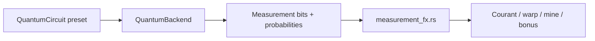

# Aspects quantiques — Quantum Sub: LA

Le jeu appelle toujours la même API `QuantumBackend::run(circuit)` ; seul le **backend** change la loi de probabilité sur les bitstrings. Le **gameplay** lit les bits de la même façon en classique et en QIP.

---

## Backends (local)

| ID | Env | Comportement |
| --- | --- | --- |
| **`classic`** | `QUANTUM_MODE=classic` | Tirage **uniforme** sur les 2^N sorties du circuit (baseline « classique ignorante »). |
| **`qip`** | `QUANTUM_MODE=quantum` | Simulateur [qip](https://crates.io/crates/qip) in-process — lois de Born, interférences des portes. |

Variables lues au lancement (voir `.env`) :

```bash
QUANTUM_MODE=classic    # ou quantum
# alias : QUANTUM_BACKEND=classic|qip
```

**Classique** : idéal pour jouer tout de suite, comparer les effets des bits sans installer Python. En 2 qubits, le HUD affiche souvent **25 %** de confiance (équiprobable).

**QIP** : même code, histogrammes **biaisés** par les portes du circuit — le % confiance varie.

Option avancée **`qiskit`** (Python + Aer) : tests CI / référence, pas requis pour jouer. Voir job `quantum-qiskit` dans [`.github/workflows/ci.yml`](../.github/workflows/ci.yml).

---

## Chaîne mesure → gameplay



Helper confiance : probabilité de l’outcome mesuré dans `Measurement.probabilities` → HUD `XX %`.

---

## Circuits utilisés en jeu

| Label | Qubits | Déclencheur | Effet gameplay |
| --- | --- | --- | --- |
| `imp-brain-v1` | 2 | Tick océan (2 s) | Bits `00`–`11` → direction + force du **courant** sur le sous-marin |
| `q-shard-stabilizer-v1` | 2 | Espace près d’une cellule | Bonus **cohérence** selon les bits ; +1 énergie |
| `quantum-teleportation-gate-v1` | 3 | Espace (warp dispo) | 3 bits → **index balise** (8 positions) + petit nudge |
| `observation-pulse-v1` | 2 | Espace (fallback) | Annule ou atténue le courant ; bonus **temps** / cohérence selon bits |
| `enemy-profile-hunter-v1` | 2 | Tick mines (2 s) | Vitesse / agressivité des mines **rouges** |
| `enemy-profile-patrol-v1` | 2 | Tick mines (2 s) | Orbite / embuscade des mines **violettes** |

Définitions des portes : [`crates/quantum/src/circuit.rs`](../crates/quantum/src/circuit.rs).  
Décodage bits → paramètres : [`crates/game/src/measurement_fx.rs`](../crates/game/src/measurement_fx.rs).

---

## Mapping 2 bits (`imp-brain`, profils mine)

| Bits | Comportement |
| --- | --- |
| `00` | Poussée avant / charge |
| `01` | Dérive droite / flanc |
| `10` | Recul / fuite |
| `11` | Dérive gauche / embuscade |

---

## Crate `quantum-town-quantum`

```rust
let mut backend = build_backend(BackendKind::Classic)?;
let m = backend.run(&QuantumCircuit::imp_brain())?;
println!("{}", m.bits); // ex. "01"
```

Trait :

```rust
pub trait QuantumBackend: Send {
    fn run(&mut self, circuit: &QuantumCircuit) -> Result<Measurement, QuantumError>;
}
```

Tests :

```bash
cargo test -p quantum-town-quantum
cargo test -p quantum-town-la --lib   # measurement_fx
```

Qiskit (optionnel) :

```bash
python3 -m venv .venv && source .venv/bin/activate
pip install -r scripts/requirements.txt
QUANTUM_PYTHON=python cargo test -p quantum-town-quantum --features backend-qiskit
```

Shim JSON : `echo '{"backend":"qiskit","circuit":{...}}' | python3 scripts/quantum_shim.py`
